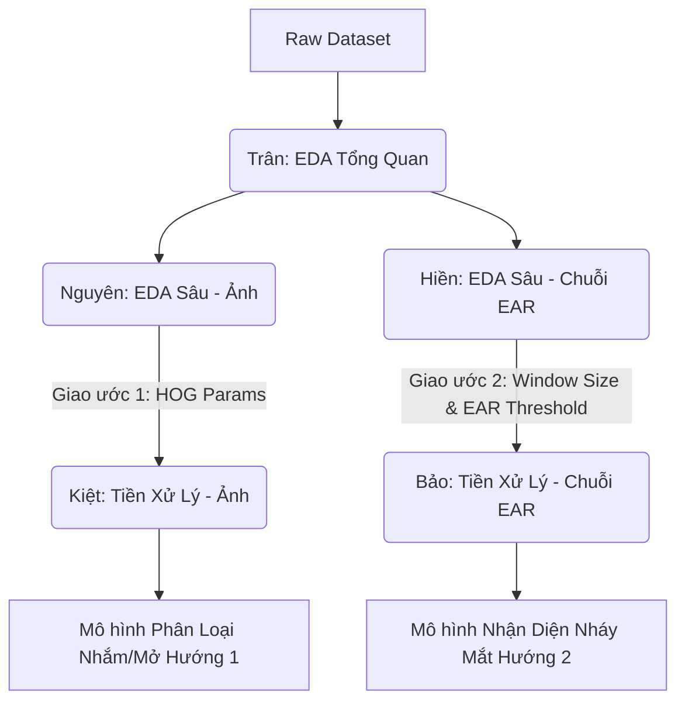

# 📋 Bảng Phân Chia Công Việc Nhóm & Quy Trình Tích Hợp (DAP_GR3)

Tài liệu này chi tiết hóa các nhiệm vụ, **Giao ước bàn giao đầu ra (Interface Contracts)**, và các kỹ thuật xử lý cụ thể cho **5 vai trò** trong nhóm nhằm phục vụ cho **2 hướng tiếp cận** của dự án.

---

---

## 🤝 GIAO ƯỚC BÀN GIAO GIỮA CÁC THÀNH VIÊN (INTERFACE CONTRACTS)

Để tránh tình trạng chồng chéo hoặc người làm Tiền xử lý phải chờ đợi/tự mò tham số, nhóm thống nhất quy trình bàn giao sau:

### 📑 Giao ước 1: Bàn giao Hướng 1 (Nguyên $\to$ Kiệt)
*   **Nguyên** có nhiệm vụ chạy thực nghiệm EDA và bàn giao cho **Kiệt**:
    1.  Bộ tham số trích xuất HOG tối ưu (Ví dụ: `orientations=8`, `pixels_per_cell=(4,4)`, `cells_per_block=(1,1)`).
    2.  Hàm trích xuất `extract_hog_features(img_gray)` đã viết sẵn bằng Python.

### 📑 Giao ước 2: Bàn giao Hướng 2 (Hiền $\to$ Bảo)
*   **Hiền** có nhiệm vụ chạy thực nghiệm EDA chuỗi và bàn giao cho **Bảo**:
    1.  Kích thước cửa sổ trượt tối ưu $N$ frames (ví dụ: chốt cửa sổ $N = 9$ frames).
    2.  Ngưỡng cắt EAR tĩnh tối ưu (ví dụ: `EAR_threshold = 0.20` tìm được qua ROC curve).
    3.  Quy luật mô tả hình chữ V của một cú nháy mắt (ví dụ: thời gian trũng tối đa là bao nhiêu frame).

---

## 👤 1. Trân: EDA Tổng Quan Dataset (General EDA)
> **Mục tiêu**: Đưa ra bức tranh tổng quan và đáng tin cậy về dữ liệu sau khi gộp để báo cáo giáo viên.

### 📝 Nhiệm vụ chi tiết:
1.  **Thống kê số lượng**: Đếm tổng số lượng bản ghi (frames/eyes), số mẫu gộp thành công (`success`) và số mẫu lỗi (`skipped`, `deleted`).
2.  **Đóng góp của thành viên**: Vẽ biểu đồ cột số lượng ảnh đóng góp của từng thành viên để thấy sự cân bằng đóng góp.
3.  **Cân bằng lớp (Class Balance)**: Phân tích tỷ lệ mẫu Nhắm (`closed`) vs Mở (`open`) trên toàn bộ dataset.
4.  **Thống kê Nhân khẩu học (Kaggle metadata)**: Tổng hợp bảng nhân khẩu học (Tuổi, Giới tính, Kính, Thiết bị) của cả nhóm.

---

## 👤 2. Nguyên: EDA Sâu Cho Hình Ảnh (Deep Image EDA)
> **Mục tiêu**: Phân tích đặc trưng thị giác để cung cấp tham số trích xuất đặc trưng tối ưu cho Hướng 1.

### 📝 Nhiệm vụ chi tiết:
1.  **Ảnh trung bình (Average Image)**: Tính và trực quan hóa ảnh trung bình (Mean Image) và ảnh phương sai (Variance Image) của 2 lớp `open` và `closed` để chứng minh sự khác biệt cấu trúc mí mắt.
2.  **Phân tích phân phối độ sáng**: Vẽ biểu đồ tần suất pixel (pixel intensity histogram) của ảnh mở/nhắm.
3.  **Tối ưu hóa HOG**: Chạy thử HOG với các tham số khác nhau, trực quan hóa HOG cạnh mắt để tìm ra bộ tham số trích xuất tốt nhất (làm nổi bật được nếp mí và con ngươi) để bàn giao cho Kiệt.

---

## 👤 3. Hiền: EDA Sâu Cho EAR & Chuỗi Thời Gian
> **Mục tiêu**: Phân tích động lực học của chỉ số EAR để thiết lập tham số cửa sổ trượt cho Hướng 2.

### 📝 Nhiệm vụ chi tiết:
1.  **Ngưỡng EAR tối ưu**: Vẽ Histogram phân bố EAR nhắm/mở. Chạy ROC Curve/Tuning để tìm ra một ngưỡng phân tách EAR tĩnh tối ưu (tối thiểu hóa lỗi phân loại nhầm).
2.  **Phân tích biến thiên EAR cá nhân**: Vẽ Boxplot chỉ số EAR khi mở mắt của 6 thành viên để chứng minh sự biến thiên cấu trúc mắt tự nhiên, làm tiền đề lý thuyết cho việc chuẩn hóa EAR cá nhân.
3.  **Xác định kích thước cửa sổ**: Thống kê số lượng frame nhắm mắt liên tục trong các cú nháy mắt thực tế. Từ đó tính toán thời lượng trung bình (mất bao nhiêu frame để nhắm và mở mắt ở tốc độ 15 FPS) để chốt kích thước cửa sổ trượt (7, 9, 11 hay 13) bàn giao cho Bảo.

---

## 👤 4. Kiệt: Tiền Xử Lý Hình Ảnh -> *Phục vụ Hướng 1*
> **Mục tiêu**: Xây dựng pipeline tiền xử lý ảnh và xuất ma trận đặc trưng chuẩn hóa cho các mô hình phân loại ảnh (SVM, CNN).

### 📝 Kỹ thuật bắt buộc phải triển khai:
1.  **Chuẩn hóa ảnh**: Đọc ảnh, convert grayscale, chia `255.0` để đưa pixel về khoảng $[0, 1]$.
2.  **Trích xuất đặc trưng HOG**: Sử dụng hàm trích xuất và tham số HOG do Nguyên bàn giao để chuyển đổi ảnh $24 \times 24$ thành vector đặc trưng HOG.
3.  **Ghép đặc trưng & Feature Scaling**: 
    *   Ghép vector đặc trưng ảnh (HOG hoặc Pixel thô) với chỉ số EAR cá nhân đã chuẩn hóa (1 chiều).
    *   **Bắt buộc**: Chạy `StandardScaler` hoặc `MinMaxScaler` trên toàn bộ ma trận đặc trưng sau khi ghép để tránh việc đặc trưng EAR (chỉ có 1 cột) bị triệt tiêu/bỏ qua bởi các mô hình nhạy cảm khoảng cách (như SVM).
4.  **Xử lý mất cân bằng lớp bằng SMOTE**:
    *   **Bắt buộc**: Chỉ áp dụng thuật toán SMOTE trên ma trận đặc trưng **sau khi** đã trích xuất HOG hoặc giảm chiều. Tuyệt đối không chạy SMOTE trực tiếp trên pixel thô (tránh sinh ảnh mắt bị nhiễu và nhòe phi thực tế).
5.  **Xuất ma trận**: Lưu tập Train/Test thành file numpy `X_train_img.npy`, `y_train_img.npy`...

---

## 👤 5. Bảo: Tiền Xử Lý Chuỗi EAR -> *Phục vụ Hướng 2*
> **Mục tiêu**: Xây dựng pipeline xử lý chuỗi thời gian EAR liên tục thành các cửa sổ trượt chuẩn hóa để train mô hình phát hiện nháy mắt (LSTM, 1D-CNN).

### 📝 Kỹ thuật bắt buộc phải triển khai:
1.  **Chuẩn hóa EAR cá nhân (Min-Max)**: Tính $\text{EAR}_{\text{min}}$ và $\text{EAR}_{\text{max}}$ cho từng thành viên và chuẩn hóa cột `ear_avg` về dải $[0, 1]$.
2.  **Nội suy phục hồi chuỗi bị đứt gãy (Temporal Interpolation)**:
    *   **Bắt buộc**: Trong dữ liệu thô sẽ có các frame bị xóa (status là `deleted` do thành viên discard lúc review). Bảo phải kiểm tra khoảng cách `frame_index` hoặc `timestamp_sec` giữa các dòng liên tiếp.
    *   Nếu có frame bị mất, sử dụng **Nội suy tuyến tính (Linear Interpolation)** để bù đắp các giá trị EAR bị thiếu, tái tạo chuỗi thời gian liên tục trước khi cắt cửa sổ.
3.  **Cắt cửa sổ trượt (Sliding Window)**: Cắt chuỗi EAR liên tục thành các cửa sổ kích thước $N$ (với $N$ do Hiền bàn giao), bước trượt $= 1$ frame.
4.  **Logic gán nhãn Nháy mắt (V-Shape Labeling)**:
    *   **Bắt buộc**: Định nghĩa nhãn cho cửa sổ dựa trên **sự thay đổi trạng thái hình chữ V**: Mở $\to$ Nhắm $\to$ Mở. 
    *   Nếu toàn bộ các frame trong cửa sổ đều nhắm (ví dụ người dùng nhắm mắt ngủ gật/microsleep), nhãn phải là `No-Blink` (0) hoặc `Long-Closure` (2) chứ không được dán nhãn là `Blink` (1) để tránh việc mô hình đếm sai số lần nháy mắt.
5.  **Xuất ma trận chuỗi**: Lưu thành file numpy `X_train_seq.npy`, `y_train_seq.npy` sẵn sàng để train.
