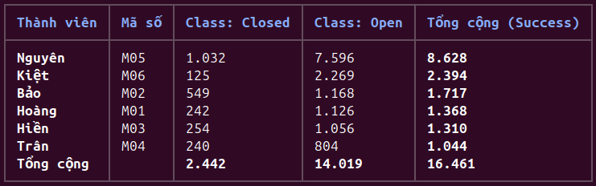
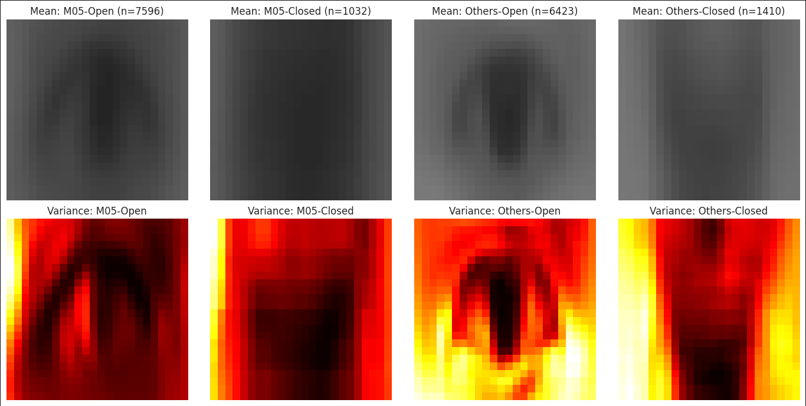
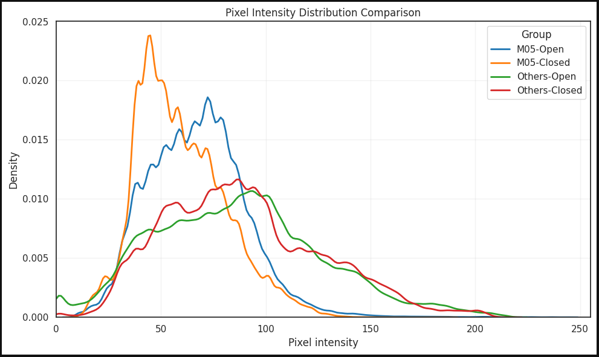
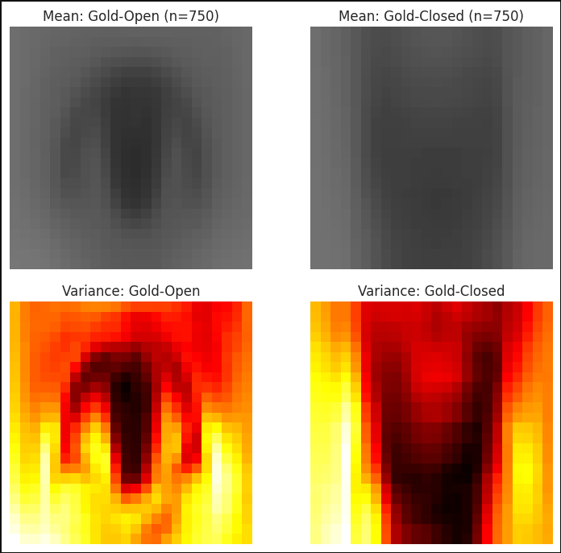
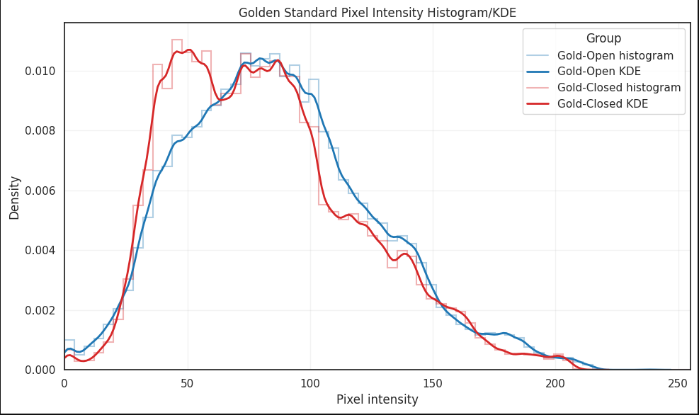
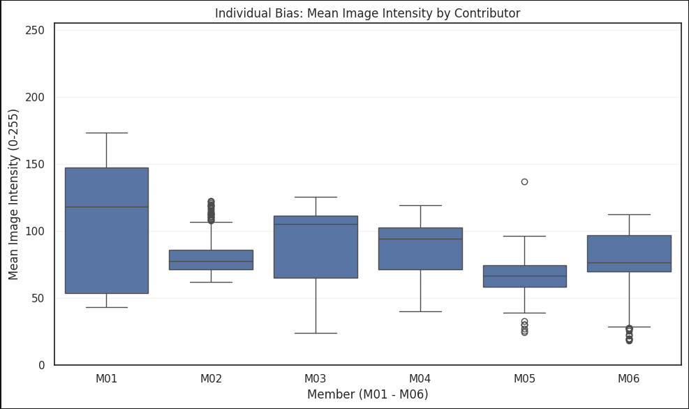
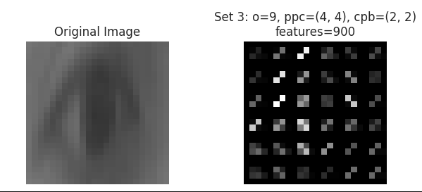
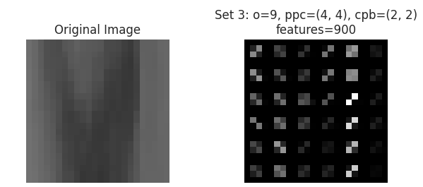

# Deep Image Exploratory Data Analysis (EDA) Report
**Performed by:** Nguyen (M05)
**Date:** 08/06/2026
**Objective:** Analyze visual characteristics of Open/Closed classes using Average Image Analysis and Pixel Intensity Histogram, evaluate data distribution among members, find optimal feature extraction parameters (HOG), and hand over the Interface Contract for the Modeling step.

---

## 1. Phase 1: Raw Dataset Analysis (Giai Đoạn 1: Đánh Giá Dữ Liệu Gốc)

### Objective & Methodology


Perform analysis on the raw dataset (16,461 images) to understand the "real-world picture" of the collected dataset. The dataset is divided into 4 groups for comparison: `M05-Open`, `M05-Closed`, `Others-Open`, `Others-Closed`.
Analysis methods include:
*   **Average Image Analysis:** Calculate Mean Image and Variance Image resized to 24x24 pixels.
*   **Pixel Intensity Histogram:** Analyze pixel brightness intensity distribution to assess lighting differences between members and classes.

### Observations & Identified Issues
*   **Shape (Mean Image):** Closed eyes and open eyes still have structural differences, however, the stability level between groups is uneven due to the number of images and different capture conditions.
*   **Imbalance Issue (Bias):** M05 data accounts for a slight majority with **8,628/16,461 images (52.41%)**, where `M05-Open` has **7,596 images** compared to only **1,032 images** for `M05-Closed`. Results show lighting bias is not that M05 is brighter than Others: mean brightness is `M05-Open` **67.20**, `M05-Closed` **59.61**, `Others-Open` **86.92**, and `Others-Closed` **89.00** respectively. The Others group is brighter and has stronger dispersion than M05.
*   **Consequence:** If the entire raw dataset is used for training without processing, the model risks learning bias based on contributor and lighting conditions, especially the large gap between `M05-Open` and other groups, instead of just learning open/closed eye features.




---

## 2. Phase 2: Golden Standard Experiment (Giai Đoạn 2: Thực Nghiệm Tiêu Chuẩn Vàng)

### Objective & Methodology
To eliminate Bias from M05 and find the "Universal Pattern" for the whole group, a "Golden Standard" dataset was built.
*   **Sampling Logic:** Randomly and absolutely fairly take exactly **125 images per class for EACH member (M01-M06)**.
*   **Scale:** `Gold-Open` (750 images) and `Gold-Closed` (750 images).
*   **Analysis:** Recalculate Mean/Variance and plot brightness distribution (Pixel Intensity Histogram/KDE) for these 2 sets.

### Data Analysis & Conclusion
After balanced sampling, the Peak Intensity has shifted to a harmonized region:
*   `Gold-Closed`: Peak at **51.27**
*   `Gold-Open`: Peak at **79.43**

**Professional Conclusion:**
1.  The impact of Bias in Phase 1 is real and very large.
2.  The Golden Standard set clearly shows separation between the two classes (Closed eyes are darker than open eyes).
3.  Since the overall data still tends to be underexposed and has large differences between individuals, it is mandatory to use block features (HOG) combined with brightness normalization algorithm (StandardScaler) for Modeling.





---

## 3. Supplementary Analysis: Individual Bias Analysis (Phân Tích Phụ: Độ lệch Cá nhân)

To better demonstrate the decision in Phase 2, a Boxplot analysis was performed to directly compare the brightness intensity distribution range of 6 members (M01-M06), with 200 samples each.



---

## 4. Phase 3: HOG Parameter Tuning (Giai Đoạn 3: Tối Ưu Hóa Tham Số HOG)

### Problem
The model needs a common set of HOG extraction parameters for both classes (Open/Closed) such that it is lighting-invariant but still captures the curve of the pupil and the horizontal line of the eyelid.

### Evaluation Algorithm (Machine Learning Approach)
Instead of evaluating by eye (prone to subjectivity), a **Linear SVM** model combined with **Cross-Validation (5-Fold)** was used directly on the Golden Standard dataset (1500 images) to "score" the separation capability of 3 parameter sets:
*   **Set 1 (8, 4x4, 1x1) - 288 features:** Worst (81.87%). Lack of block normalization makes data prone to noise.
*   **Set 2 (9, 8x8, 2x2) - 144 features:** Fair (87.47%). Runs fast but 8x8 grid is too large on 24x24 image, losing thin eyelid details.
*   **Set 3 (9, 4x4, 2x2) - 900 features:** **Best (89.20%)**. Perfect balance between keeping eyelid details and shadow normalization.





---

## 5. Interface Contract (Giao Ước Bàn Giao)

Based on the entire EDA process, below is the Interface Contract for the Preprocessing & Model Training department (Kiet).

```python
# ============================================================
# INTERFACE CONTRACT (EDA TO PIPELINE)
# ============================================================
from skimage.feature import hog

HOG_PARAMS = {
    'orientations': 9,
    'pixels_per_cell': (4, 4),
    'cells_per_block': (2, 2),
    'feature_vector': True
}

def extract_hog_features(img_gray):
    """
    Optimized HOG feature extraction function.
    Notes from EDA: 
    1. INPUT image must be Grayscale.
    2. Size must be 24x24.
    3. Brightness normalization (StandardScaler) on HOG feature vector 
       is required to minimize individual bias.
    """
    features = hog(img_gray, **HOG_PARAMS)
    return features
```
